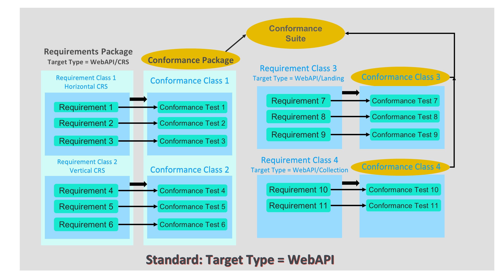

[[introduction]]

= Introduction to key ModSpec concepts with examples

This ModSpec User Guide describes the key concepts defined in the OGC ModSpec <need reference>. Further, this document provides AsciiDoc/Metanorma examples of how to code
the various key concepts in an OGC normative document. 

NOTE: For information on the current OGC publication template for a standard, visit https://github.com/opengeospatial/templates/tree/master/standard[here].

NOTE: For detailed guidance on using the OGC Metanorma publication rules, specifically for the ModSpec elements discussed in this User Guide, visit https://www.metanorma.org/author/topics/blocks/requirements-modspec/[here]

== An example 

The following is an abstract example of how the key concepts in the ModSpec model can be structured and described in a (simple) standard.



The following sections describe each of the key concepts in more detail and provides detailed examples of how each concept
is physically expressed in a standard.

== Fundamentals

=== Standardization goal

Every new OGC Standards or revision to an OGC Standard must state a `standardization goal`. This is a concise statement of the 
problem that the standard addresses and the strategy envisioned for achieving a solution. Also termed a `problem statement`, the goal clarifies the issue to be addressed, 
ensuring that everyone involved understands the problem, its significance, and why its important to solve. For example:

```
The goal of the OGC Core Tiling Conceptual and Logical Models for 2D Euclidean Space Abstract Specification is to define a 
simple conceptual model that can support any and all requirements for tiled data stores and applications including extensions 
for visualization, portrayal, analytics, filtering, levels of detail, and so forth. Having a common conceptual model will 
enhance interoperability by ensuring common semantics across logical models and physical implementations.
```

=== Standardization Target Type

Standardization Target Type is an abstract representation of one of the actors or entities identified in the Standardization Goal. 
In the above standarization goal example, the target type is a `conceptual model`. 

A standardization target type can be structured as a hierarchy. The root specifies the overarching target type for a standard. There can then be 
target subtypes that derive from the root superclass. For example, the OGC API - Features Standard has a target type of `WebAPI`. There are then
subtypes such as WebAPI/landing-page and WebAPI/crs or branches such as client and server. 

Why the target type concept is important is shown below in the discussion on `requirement`. 

=== Standardization Target

Implementations of a standard are the real world instantiation of requirements defined in the standard. From that
perspective, the Standardization Target is an implementation of a Standardization Target Type. These are the real-world 
entities which can be tested for conformance with the requirements documented in the standard.

=== More examples of Standardization Target Types and Standardization Targets

The following are two examples of Target Types and Targets as used in the OGC API suite of standards:
```
    OGC API Standards
        Standardization target type: Web API
        Standardization target: Any API that is consistent with the web architecture (HTTP, web linking, etc) 
        and implements a requirements class of an OGC API standard.

    OGC JSON - Feature Geometry
        Standardization target type: JSON documents (or JSON objects)
        Standardization target: Any JSON document (or object) that implements the Core requirements 
        class of JSON-FG. The document can be a created by an API as a response document representing 
        a features collection or by a tool like GDAL, FME, QGIS, etc.
```


=== OGC Identifiers

ModSpec Requirement 2 states, "Each component of a standard, including requirements, requirements packages, requirements classes, conformance tests 
conformance packages, and conformance test classes _SHALL_ be assigned a unique identifier and/or label." OGC Policy 
Directive https://portal.ogc.org/public_ogc/directives/directives.php#33[33] specifies that such identifiers are URIs and _SHALL_ 
be structured per the rules specified in the OGC Naming Authority policy doucment https://docs.ogc.org/pol/10-103r1.html[OGC Name Type Specification - specification elements]

Every OGC Standard has a subclause titled `Identifiers`. This subclause is included in the `Conventions` Clause. The purpose of the subclause is
to specify the URI namespace for the standard and to define the rules for how partial URIs are related to that namespace. The following example is 
from the OGC ModSpec version 1.1:

```
The normative provisions in this Standard are denoted by the URI namespace:

https://www.opengis.net/spec/modspec-1/1.1/

All requirements that appear in this document are denoted by partial URIs which are relative to the namespace shown above.

For the sake of brevity, the use of “req” in a requirement URI denotes:

https://www.opengis.net/spec/modspec-1/1.1/

An example might be:

/req/core/crs
```

== Requirement

`requirement` is a fundamental ModSpec concept. A requirement clearly states a condition (rule) to be satisfied in any implementation of the standard. 
A requirement must be stated in “normative” language. In the OGC, the use of the word `SHALL` indicates that a requirement is being presented.
Other standards organizations use the verb `MUST` to indicate a requirement is being stated. An example of a requirement is:

```
An implementation _SHALL_ specify a coordinate reference system (CRS)
```

The above example is fairly nebulous and open to interpretation as to how the CRS is identified and/or expressed. Therefore, the ModSpec states that
a requirement `MAY` be stated as one or more `parts` where each part specified additional rules for that requirement. Expanding the above example:

```
An implementation _SHALL_ specify a coordinate reference system (CRS). An EPSG code _SHALL_ be used to 
indentify the CRS. The CRS _SHALL_ be referenced by a uniform resource identifier (i.e., a URI)  
such as http://www.opengis.net/def/crs/EPSG/0/4326
```

The above multi-part statement of the CRS requirement could be split into three separate requirements. However, for clarity and readability, a multipart requirement
may be a better choice.

The ModSpec further states that any requirement `SHALL` be uniquely identified and/or labeled. For example, the above 
requirement could be labeled `Requirement 1`. The above requirement could also be identified by a URI such as http://www.opengis.net/spec/ogcapi-features-2/1.0/req/crs.
In the OGC, requirements are  labeled and have a unique indentifier (URI). So the above CRS example could be written as below and be compliant with the requirements
of the ModSpec

```
Label: Requirement 1
Identifier: http://www.opengis.net/spec/ogcapi-features-2/1.0/req/crs
An implementation SHALL specify a coordinate reference system (CRS). An EPSG code SHALL be used to 
indentify the CRS. The CRS SHALL be referenced by a uniform resource identifier (i.e., a URI)  
such as http://www.opengis.net/def/crs/EPSG/0/4326
```

Finally, if a requirement is stated in multiple parts, all parts must have the same standardization target type.

=== Template for a documenting a requirement

To ensure that all standards documents have the same look and feel, a standard (consistent) template should be used for stating requirements.
The ModSpec does not specify any templates for how a requirement is specified - only the what the content is. In the OGC, requirements are specified 
using an AsciiDoc/Metanorma template. This is because in the OGC, all standards documentation is now done using GitHub capabilities. 
The OGC has standardized on Metanorma for document publication. 

The following AsciiDoc examples both work in the OGC publication process. The first is the `traditional` OGC AsciiDoc template and the second is formatted specifically for the Metanorma publication process.

==== OGC Traditional AsciiDoc encoding example

The following is an example of the AsciiDoc coding as used in most OGC Standards prior to the transition to the use of Metanorma for publication.

```
[[req-1]]
[width="90%",cols="2,6"]
|===
^|*Requirement 1* | */req/core/crs* +
^| A | An implementation SHALL specify a coordinate reference system (CRS).
^| B | An EPSG code SHALL be used to indentify the CRS. 
^| C | The CRS SHALL be referenced by a uniform resource identifier (i.e., a URI) such as http://www.opengis.net/def/crs/EPSG/0/4326
|===
```

==== Metanorma encoding example 

The following is an example of an AsciiDoc coding conformant to the OGC requirements for publication using Metanorma. Notice that the short form for the URI identifier is used. See above for an explanation of the use of unique identifiers for requirements in OGC Standards.

```
[[req-1]]
[requirement]
====
[%metadata]
identifier:: /req/core/crs
statement:: Rules for CRS in implementations of this OGC xyz Standard
part:: An implementation SHALL specify a coordinate reference system (CRS).
part:: An EPSG code SHALL be used to indentify the CRS.
part:: The CRS SHALL be referenced by a uniform resource identifier (i.e., a URI) such as http://www.opengis.net/def/crs/EPSG/0/4326
====
```

The above requirement example, formatted for Metanorma, does not have a requirement label such as Requirement 1 as shown in the traditional AsciiDoc example. 
Labels for requirements are generated during the Metanorma publication process. The `req-1` is a bookmark. Bookmarks can be used for
quick navigation within an OGC standards document. Also note the use of the `statement` element. This is a mandatory Metanorma element  

Below is how these two examples would look after document publication:

==== Traditional OGC AsciiDoc publication example

[width="90%",cols="2,6"]
|===
^|*Requirement 1* | */req/core/crs* +
^| A | An implementation SHALL specify a coordinate reference system (CRS).
^| B | An EPSG code SHALL be used to indentify the CRS. 
^| C | The CRS SHALL be referenced by a uniform resource identifier (i.e., a URI) such as http://www.opengis.net/def/crs/EPSG/0/4326
|===

==== Metanorma publication example

[requirement]
====
[%metadata]
identifier:: /req/core/crs
statement:: Rules for CRS in implementations of this OGC xyz Standard
part:: An implementation SHALL specify a coordinate reference system (CRS).
part:: An EPSG code SHALL be used to indentify the CRS.
part:: The CRS SHALL be referenced by a uniform resource identifier (i.e., a URI) such as http://www.opengis.net/def/crs/EPSG/0/4326
====

== Conformance Test

In most cases, every requirement in an OGC standard will have a corresponding `conformance test`. A conformance test checks if an 
implementation of a requirement is valid: Passes or fails. The general rule is that every requirement has a corresponding 
(one to one) conformance test. The exception is if the requirement is so abstract that it cannot be tested. In this case, 
the exception should be noted in the standard. Please note that if a standard has a core and multiple parts (profiles/extensions), then each 
part/profile/extension will have its own conformance suite composed of conformance tests. 
 
The collection of all conformance tests for a standard is called a `conformance suite`.
In the template for an OGC standards document, the conformance suite is specified in Annex A, Conformance Test Suite.

Please note that the ModSpec does not define how a conformance test is documented or structured. Further, 
the ModSpec does not specify how conformance tests are executed.

However, as with a requirement, every conformance test `SHALL` have a unique identifier and/or label. 
In the OGC, each conformance test has a unique identifier (URI). 

The ModSpec does provide a test suite for the ModSpec. The structure and content used in the ModSpec conformance test suite has 
become the de-facto template for defining conformance tests in OGC Standards.

=== Template for documenting a Conformance Test

As with stating requirements, to ensure that all standards documents have the same look and feel, 
a standard (consistent) template should be used for stating conformance tests. 

The following AsciiDoc examples both work in the OGC publication process. The first is the `traditional` OGC AsciiDoc template 
and the second is formatted specifically for the Metanorma publication process.

==== Traditional OGC AsciiDoc encoding

In the following AsciiDoc encoding, the `Test ID` is the unique URI identifier for the test. The `Requirement` element is the
requirement being tested. The test purpose specifies the reason and intention to determine whether an implementation passes
the test or not. The `Test Method` is how the test is performed. In the following example, the method is visual inspection. Any standard
implementing the ModSpec model and structure is tested via visual inspection: Reading the document and ensuring all requirements 
are implemented as specified in the ModSpec.

```
[cols=">20h,<80d",width="100%"]
|===
|Test ID: |/conf/conf-class-a/requirements/REQ1_core.adoc
|Requirement: |/req/req-class-a/core
|Test purpose: | To verify that a tiling specification conforms to the tiling logical +
core model for the 2D Euclidean plane use case.
|Test method: | Inspect documentation.
|===
```

==== Metanorma AsciiDoc encoding

```
[abstract_test]
====
[%metadata]
identifier:: /conf/core/all-components-assigned-uri
target:: /req/core/all-components-assigned-uri
test-purpose:: Validate that each component of a standard, including requirements, requirements packages, requirements classes, 
conformance test, conformance packages, and conformance test classes are assigned a unique identifer or label.
test-method:: Inspect the document to verify the above.
====
```

Notice that the element names are quite similar with the exception of "target" instead of "requirement". 
The concepts of "target" and "target types" is provided later in this document.

==== Traditional AsciiDoc publication example

The above Traditional AsciiDoc example would appear as follows when published.

[cols=">20h,<80d",width="100%"]
|===
|Test ID: |/conf/conf-class-a/requirements/REQ1_core.adoc
|Requirement: |/req/req-class-a/core
|Test purpose: | To verify that a tiling specification conforms to the tiling logical +
core model for the 2D Euclidean plane use case.
|Test method: | Inspect documentation.
|===

==== Metanorma AsciiDoc publication example

The above Metanorma AsciiDoc example would appear as follows when published.

====
[%metadata]
identifier:: /conf/core/all-components-assigned-uri
target:: /req/core/all-components-assigned-uri
test-purpose:: Validate that each component of a standard, including requirements, requirements packages, requirements classes, 
conformance test, conformance packages, and conformance test classes are assigned a unique identifer or label.
test-method:: Inspect the document to verify the above.
====

==== Non-visual inspection test

Obviously - and depending on the standard - not all implementations are visually inspected for conformance. Below 
is an example of a conformance test that can be automated. The following test from OGC API - Records can be fully automated.

====
[%metadata]
identifier:: /conf/local-resources-catalog/conformance
target:: /req/local-resources-catalog/conformance
test-purpose:: Validate conformance identification.
test-method::
+
--
. Construct a path for a https://docs.ogc.org/is/17-069r4/17-069r4.html#_operation_3[conformance page].
. Issue an HTTP GET request on that path.
. Check that the `conformsTo` array contains the value `http://www.opengis.net/spec/ogcapi-records-1/1.0/conf/local-resources-catalog`.
. If the server supports JSON responses, check that the `conformsTo` array contains the value `http://www.opengis.net/spec/ogcapi-records-1/1.0/conf/json`.
. If the server supports HTML responses, check that the `conformsTo` array contains the value `http://www.opengis.net/spec/ogcapi-records-1/1.0/conf/html`.
--
====

== Requirements class

Requirements should be organized into `requirements classes`. A requirements class is an aggregate of requirements with a 
single standardization target type that must all be satisfied to pass a conformance test class. A requirements class is therefore comprised 
of one or more requirements with the same target type/subtype. Typically in an OGC Standard, all discussion of a given requirements
class and associated requirements are in the same clause/subclause(s) in the standards document. This provides a logical modular 
structure to the standards document.

NOTE: A Requirements Class does not contain `Recommendations`. 

Further, all elements of a requirements class are documented in a table. The structure and layout of this table is dictated by the OGC template.

Below is an AsciiDoc example of an OGC requirements class table formatted for Metanorma publication. The following example is a snippet from the OGC ModSpec core requirements class.

```
[[req_class-core]]
[requirements_class]
.Requirements Class 'Core'
====
[%metadata]
identifier:: https://www.opengis.net/spec/modspec-1/1.1/req/req-class-core
target-type:: Standard
requirement:: /req/core/reqs-are-testable
requirement:: /req/core/all-components-assigned-uri
requirement:: /req/core/vocabulary-and-parent-req-class
requirement:: /req/core/single-standardization-target-type
====
```

The requirements class table can include information on direct dependencies. For example, a coordinate reference system requirements class could 
state a dependency on ISO 19111:2019 Geographic information — Referencing by coordinates. In this case, the published requirements class table might 
appear as:

[cols="1,4",width="90%"]
|===
2+|*Requirements Class - Coordinate Reference System (CRS) Specification and Representation.* 
2+|/req/core/crs-representation 
|Target type | Operations
|Dependency |OGC Abstract Specification Topic 2: Referencing by coordinates (ISO 19111:2019)
|Requirement CRS01  |/req/core/crs/crs-topic2 
|Requirement CRS02  |/req/core/crs/crsStorage 
|===

The above example is rendered using the "traditional" OGC AsciiDoc coding.

== Requirements Package

A `requirements package` is a set (grouping) of related requirement classes and their associated components. Quite often, 
a standard may have related requirements classes, recommendations, and permissions of the same target type. An example is 
the https://github.com/opengeospatial/cdbswg/blob/master/cdb-2.0/23-034/sections/cdb-core-crs-requirements-package.adoc[CDB 2.0 Coordinate Reference System Requirements Package]. The CDB 2.0 CRS Requirements Package consists of two requirements classes, recommendations and permissions. 

== Conformance Class

A `conformance class` a set of conformance tests that must be passed to receive a single certificate of conformance. The OGC ModSpec states
that for each requirements class there is a corresponding conformance class. This one to one relationship is shown in Figure 1. This means 
that for each requirement in a requirements class there is a corresponding (one to one) conformance test in the conformance class. Finally, all
conformance tests in a conformance class have the same standardization target. 

This implies that each requirement is in exactly one requirements class and
all references to that requirement from another requirements class must include its
complete "home" requirements class. This means that requirements for dependencies will often result in 
conformance test cases which require the execution of the dependency conformance class. For example,
using the ModSpec as an example: An implementation passing the UML conformance test class _SHALL_ first 
pass the ModSpec core conformance test class.

=== Metanorma/AsciiDoc coding example for conformance class.

The following is an example of an AsciiDoc coding following the Metanorma publication rules. This example is a 
snippet  of the ModSpec 1.1 core conformance class. The example is consistent with the Requirements Class example shown above.

```
[[ats_class-core]]
[conformance_class]
.Conformance Class 'Core'
====
[%metadata]
identifier:: https://www.opengis.net/spec/modspec-1/1.1/conf/conf-class-core
target:: https://www.opengis.net/spec/modspec-1/1.1/req/req-class-core
abstract-test:: /conf/core/reqs-are-testable
abstract-test:: /conf/core/all-components-assigned-uri
abstract-test:: /conf/core/vocabulary-and-parent-req-class
abstract-test:: /conf/core/single-standardization-target-type
====
```

The above AsciiDoc code would render as follows when published.

[conformance_class]
.Conformance Class 'Core'
====
[%metadata]
identifier:: https://www.opengis.net/spec/modspec-1/1.1/conf/conf-class-core
target:: https://www.opengis.net/spec/modspec-1/1.1/req/req-class-core
abstract-test:: /conf/core/reqs-are-testable
abstract-test:: /conf/core/all-components-assigned-uri
abstract-test:: /conf/core/vocabulary-and-parent-req-class
abstract-test:: /conf/core/single-standardization-target-type
====

== Dependencies

The concept `dependency` is important in the design and crafting of modular standards. Quite often, a requirement or 
requirements class may have a dependency on a requirement or requirements stated in some other standard. For example, 
most OGC standards that state requirements for how to specifiy and/or use coordinate reference systems specify a dependency
on https://docs.ogc.org/as/18-005r4/18-005r4.html[OGC Abstract Specification Topic 2: Referencing by coordinates]. Such a dependency
is shown using the `dependency` element in the AsciiDoc coding. Dependencies can be general as in the above example or they can be more specific.

A specific dependency is termed a `direct dependency`. A direct dependency is another requirements class (the dependency) whose requirements 
are defined to also be requirements of this requirements class.

In UML modelling,  this is a Dependency which is is a directed relationship which is used to show that some UML element or a set of elements 
requires, needs or depends on other model elements for specification or implementation. 


