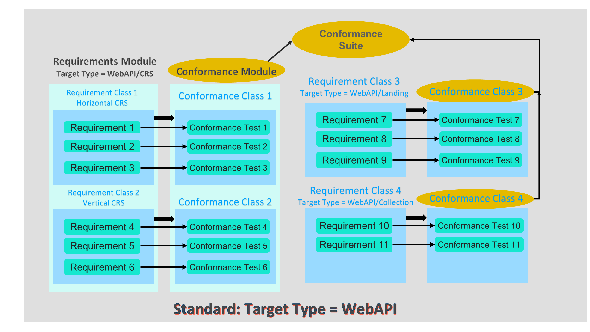

[[introduction]]

= Introduction to key ModSpec concepts with examples

This section describes and provides examples of the key concepts of the ModSpec.

`requirement` is a fundamental concept. A requirement clearly states a condition (rule) to be satisfied in any implementation of the standard. 
A requirement must be stated in “normative” language. In the OGC, the use of the word `SHALL` indicates that a requirement is being presented.
Other standards organizations use the verb `MUST` to indicate a requirement is being stated. An example of a requirement is:

```
An implementation `SHALL` specify a coordinate reference system (CRS)
```

The ModSpec further states that any requirement `SHALL` be uniquely identified and/or labeled. 



