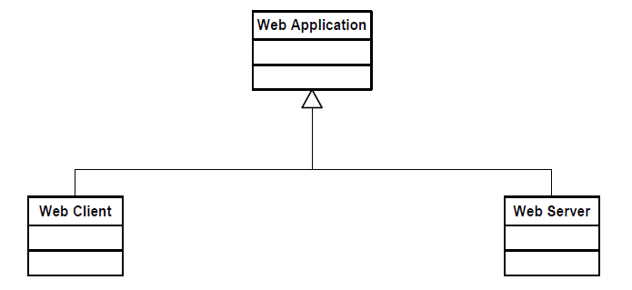

[[cls-8]]

== ModSpec Requirements Class: Core

This clause specifies the requirements, recommendations, and permissions for the content and structure of a modular standard. 
This collection of requirements, recommendations, and permissions are also known as the `core` of the ModSpec. 
All the requirements specified in this ModSpec core comprise the ModSpec Core Requirements Class. 

include::../requirements/requirements_class_core.adoc[]

[[cls-8-1]]
=== General Requirements

The following requirement states that every requirement in a standards document is associated with one and only one requirements class(es).

[width="90%",cols="2,6"]
|===
|*Requirement 28*
|/req/core/reqs-are-in-class +
Each requirement in a standard SHALL be associated with exactly one requirements class.
|=== 

////
Temporarily remove until metanorma numering issue fixed
include::../requirements/core/REQ028_reqs-are-in-class.adoc[]
////

There may be one or more requirements in a requirements class. 

The following requirement states that every requirement is testable.

[[req-1]]
include::../requirements/core/REQ001_testable.adoc[]

Therefore, by definition, any requirements class that contains the requirement that failed to pass also fails to pass.

The following requirement states that every component of a standard will have a unique identifier

[[req-2]]
include::../requirements/core/REQ002_assigned-uri.adoc[]

The following recommendation encourages the consistent use of these unique identifiers/labels in the standard 
as well as any external documentation referencing that standard.

[[rec-1]]
include::../recommendations/core/REC001_uri-external-use.adoc[]

While a requirement may be referenced in more than one place in a standard, the normative definition of a requirement is its "*#home#*" (see <<cls-6-3>>) and
will be the only place where full normative language is used.

The following permissions relate to possible content specified in the core of a standard. In this manner, the core requirements class and its associated content can be
thought of not only as the requirements of the core conformance class, but as a form
of reference model for establishing core vocabularies and schemas for the entire standard.

include::../permissions/core/PER001_informational-content.adoc[]

The following states how and where vocabularies are specified in relation to a requirements class.

[[req-3]]
include::../requirements/core/REQ3_vocabulary.adoc[]

[[per-2]]
include::../permissions/core/PER002_external-vocabs-core.adoc[]

For example, consider the specification of a metadata service in which the Dublin Core concept "Title" and
the XML schema structure used for its specification can be in the core of the service
standard. How a particular request-response pair uses the data structure to mean
the title of a particular document or dataset will be specified in the requirements
class in which the request-response pair is defined and set against requirements.

[[cls-8-2]]
=== Using the model

The primary difficulty in speaking about standards (or candidate
standards) as a group is their diverse
nature. Some standards use UML to define behavior, others use XML or JSON to define data
structures, and others use no specific modeling language at all. However, they all
must model the standardization target type to which they apply since they need to use
unambiguous language to specify requirements. Thus, the only thing they have in
common is that they define testable requirements against some
model of an implementation of the standard (the standardization target type). For
completeness, they should also specify the conformance tests for these requirements
that are to be run for validation of the implementations against those
requirements.

The assumption is that each standard has a single
(root) standardization target type from which all extensions inherit. If this is not
true, then the standard can be logically factored into parts each corresponding
to a "root" standardization target type, and that the standard addresses each
such part separately (see the definition of 
<<RequirementsClass-definition,requirements class>>). In this sense, the next requirement divides the
standard into parts more than restricting their content.

[[req-4]]
include::../requirements/core/REQ4_single-standardization-target-type.adoc[]

In practice, the standardization target type of the core requirements class is the root
of an inheritance tree where extensions all have the core's target type as an ancestor,
and thus can be considered as belonging to the same "class" or type as the core's
target type.

[[req-5]]
include::../requirements/core/REQ5_test-class-single-standardization-target.adoc[]

This means that all requirements are considered as targeting the same entity being
tested for a particular certificate of conformance. The test may specify other types
as intermediaries or indirect dependencies (see <<IndirectDependency-definition,indirect dependency>> of-a-requirements-class).

include::../permissions/core/PER003_repeated-requirements.adoc[]

A repeated requirement will be in a separate requirements class. This is because it will have a
separate standardization target and thus belong to the requirements to be tested by
a separate conformance class. For example, in a service interface, a standard
may be written that requires both the client and server to use a particular language
for data transmission. Since the client and server are different standardization
targets types (except in some special circumstances), they will have different
conformance test classes.

One solution is to state the requirement twice, once for each target. An
alternative is to introduce a new "superclass". 

include::../permissions/core/PER004_abstract-superclass.adoc[]

An example is provided below.

[[fig-6-1]]
.Abstract superclass example

[[cls-8-3]]
=== The "standards" document

Each standards document is comprised of a set of requirements and their associated conformance tests. 
Requirements are grouped into requirements classes. Each requirements class is contained within one section/clause in a standards document.

[[req-6]]
include::../requirements/core/REQ6_requirements-grouped.adoc[]

The following requirement states that the sequence of requirements and requirements classes 
is the same as the sequence of conformance tests and conformance classes in the conformance suite.

[[req-7]]
include::../requirements/core/REQ7_requirements-test-suite-structure.adoc[]

If two requirements are in the same requirements class, they should be tested in the same conformance
class in the conformance suite. Each requirement is separately identifiable
either by a unique label and/or identifier as is done in the ModSpec.

In summary, the structure of the requirements and requirements classes of the model
should be reflected in the organization of the conformance tests and classes, and
also in the structure of the normative clauses in the specification document.

[[cls-8-4]]
=== Conformance Test Suite

The requirements specified in this clause will be applied directly to the test suite, and in particular
to the conformance classes. By definition, a "test suite" is a collection of
identifiable conformance classes. A conformance class is a well-defined set of
conformance tests. Each conformance test is a concrete or abstract (depending on the
type of suite) description of a test to be performed on each candidate conformant
implementation, to determine if it meets a well-defined set of requirements as
stated in the normative clauses of the standards document.

NOTE: The Conformance Test Suite is normative in the sense that it describes the tests to be
performed to pass conformance, but it specifies no requirements in any other sense.
The requirements are specified in the body of the standard. The test suite
only describes in detail how those requirements should be tested.

[[req-8]]
include::../requirements/core/REQ8_requirements-correspondence.adoc[]

Strict parallelism of implementation and governance is the essence of this standard.

[[cls-8-5]]
=== Requirements for Modularity

[[cls-6-5-1]]
The following states that each conformance class tests a complete requirements class

[[req-9]]
include::../requirements/core/REQ9_no-optional-tests.adoc[]

This requirement stops
conformance classes from containing optional requirements and tests, and, at least
as far as the standard is concerned, makes all certificates of conformance mean
that exactly the same tests have been conducted. Standards documents may use
recommendations for such options, but the conformance test classes do not test
recommendations.

include::../permissions/core/PER005_conf-class-paramterized.adoc[]

This means that the class's tests
depend on some parameter that must be defined before the tests can be executed. This can
be thought of as an "if-then-else" decision tree. 

For example, if a conformance class needs to apply tests against a specific data format, such as GML or
KML, then XYZ(GML) is XYZ using GML, and XYZ(KML) is XYZ using KML.
Because the parameters choose which requirements will be tested, two conformance
tests with distinct parameters should be considered as distinct conformance
classes.

The most common parameters are the identities of indirect dependencies. For example,
if a service uses or produces feature data, the format of that data may be a
parameter, such as GML, KML or GeoJSON. When reading a certificate of conformance,
the values of such parameters are very important.

[[req-10]]
include::../requirements/core/REQ10_all-parameters-expressed.adoc[]

Conformance to a particular conformance class means exactly the same thing everywhere.

[[req-11]]
include::../requirements/core/REQ11_conf-class-single-req-class.adoc[]

This means that there is a strict correspondence between the requirements classes
and the conformance test classes in the test suite. Recall that a conformance test
class may specify dependencies causing other conformance test classes to be used,
but this is a result of an explicit requirement in the "home" requirements class.

[[req-12]]
include::../requirements/core/REQ12_con-class-dependencies.adoc[]

Such referenced conformance classes may be in the same standard or may be a
conformance class of another standard.

The following is an example of an indirect dependency. If a service specifies that a particular output is required to be conformant to a
conformance test class in a specific standard (say a normatively referenced XML
schema), then the conformance class of that normative reference will be used to test
that output. For example, if an OGC Web Feature Service (WFS) implementation instance specifies that its feature collection output is
compliant to a particular profile of GML, then that profile of GML will be used to
validate that output. This means that the service is indirectly tested using the GML
standard. In other words, GML is an indirect dependency of the original service.

Requirements classes may be optional as a whole, but not piecemeal. This means that
every implementation that passed a particular conformance class satisfies exactly
the same requirements and passes exactly the same conformance tests. Differences
between implementations will be determined by which conformance test classes are
passed, not by a listing of which options within a class were tested. If a
standard's authors wish to make a particular requirement optional, <<req-9>>
forces them to include it in a separate requirements class (and therefore in a
separate conformance test class) which can be left untested.

NOTE: Standards developed outside the OGC may not follow a strict parallelism between requirement specification
and testing, so for use within a standard compliant to the ModSpec, special
care must be taken in importing conformance test classes from other standards.

[[req-13]]
include::../requirements/core/REQ13_imported-requirements-class.adoc[]

The tracking of the parallelism between requirements and tests should be easy if the
standards document is non-ambiguous. To ensure this, by utilizing the names of the two types of classes, the following requirement places a
default mapping between the two.

[[req-14]]
include::../requirements/core/REQ14_all-classes-explicitly-named.adoc[]

Logically, a requirements class (set of requirements) and a conformance class (set
of tests) are not comparable. This can be remedied by noting that both have a
consistent relation to a set of requirements. A requirements class is a set of
requirements. A conformance class tests a set of requirements. Therefore a requirements class corresponds precisely to a conformance class if they
both are related (as described) to the same set of requirements.

[[cls-6-5-2]]
The following states that requirements classes contain all requirements tested by a conformance test case

[[req-15]]
include::../requirements/core/REQ15_conf-class-test-req-class.adoc[]

Unless a requirement is referenced in a conformance test and thus in a conformance
class, it cannot be considered a requirement since no test has been defined for it.

[[rec-2]]
include::../recommendations/core/REC002-parallel-structure.adoc[]

The above requirement in conjunction with <<req-9>> means that all requirements in a conformant
standard will be tested in some conformance class. In the best example, a
requirement should be contained explicitly in one and only one requirements class
and tested in one and only one conformance class. This is not really a requirement
here, since a single requirement can be stated twice in different requirements
classes with different standardization target types.

[[req-16]]
include::../requirements/core/REQ16_co-dependent-requirements.adoc[]

Normally, circular dependencies between implementation components are signs of a
poor design, but they often cannot be avoided because of other considerations (code
ownership for example). 

[[rec-3]]
include::../recommendations/core/REC003-circular-dependencies.adoc[]

[[req-17]]
include::../requirements/core/REQ17_structure-requirements-classes.adoc[]

NOTE: The only certain manner to test this requirement maybe to create a reference implementation.

This requirement is more important and may be more difficult than it seems. It
states simply that conformance classes and their associated requirements classes can
be put in a one-to-one correspondence to a fully modular implementation of the
complete standard (at least against a single
standardization target). Implementors who wish to sacrifice modularity for some
other benefit can still do what they want. The requirement here only states that if
the software requirements classes are properly separated, they can be implemented in
a plug and play fashion.

[[req-18]]
include::../requirements/core/REQ18_requirements-and-dependencies.adoc[]

This means, for example, that a UML classifier cannot be redefined in a new
extension. If a new version of the classifier is needed it has to be a valid subtype
of the original.

In terms of generalization, subclassing, extension and restriction (into a new class
or type) are all acceptable, redefinition (of an old class or type) is not.

<<cls-8-3>> makes suggestions as to how to organize the conformance
classes and normative clauses in parallel to make this requirement easier to verify.

Most standards include examples, which are useful for illustrative or pedagogical
purposes. However, it is not possible to write a standard "by example" that
supports conformance testing. Examples are therefore non-normative, by definition.

[[cls-6-5-3]]
==== Profiles are defined as sets of conformance classes

All the conformance classes created in a standard form a base (an upper bound
of all conformance classes) for defining profiles as defined in ISO/IEC 10000 (see
<<iso-dp2>>). The base for creating a profile can be defined as the union of all
requirements classes.

[[req-19]]
include::../requirements/core/REQ19_profile-conformance.adoc[]

[[cls-6-5-4]]
=== There is a Defined Core

The following requirements define the content of the core.

[[req-20]]
include::../requirements/core/REQ20_core-requirements-separate.adoc[]

The following states that any recommendations applicable to the entire standard are in the core document.

[[req-21]]
include::../requirements/core/REQ21_general-recommendations-core.adoc[]

The following states that all non-core requirements classes have a standardization target type that is a sub-type of the core.

[[req-22]]
include::../requirements/core/REQ22_req-class-not-core-stt-subtype-of-core.adoc[]

The following recommendation is guidance to the group developing a standard to keep the core as simple as possible.

[[rec-4]]
include::../recommendations/core/REC004-simple-core.adoc[]

The following enables the development and documentation of anstract standards. Examples of such standards are the OGC Abstract Specification.
Typically, an abstract standard cannot be directly implemented.

include::../permissions/core/PER006_core-type.adoc[]

The following enables the ability of the standard being developed and then implemented to reference, as normative, conformance classes from another standard. 
An example in the OGC would be OGC API - Records Standard core referencing conformance classes defined in the OGC API - Common Standard. By definition
these externally defined conformance classes need to be passed in order to claim compliance.

include::../permissions/core/PER007_req-class-another-standard.adoc[]

[[rec-5]]
include::../recommendations/core/REC005-optional-tests.adoc[]

Since the core requirements class is contained (as a direct dependency) in each
other requirements class with a similar standardization target type, the general
recommendations are thus universal to all requirements classes. 

include::../permissions/core/PER008_core-maybe-recommendations.adoc[]

NOTE: In most cases, if someone feels the need to define a "simple" version of the
standard, it is probably a good approximation of the best core. For example, the
core of a refactored GML might be the equivalent of the "GML for Simple Features"
profile. The core for any SQL version of feature geometry is probably "Simple
Features."

[[cls-6-5-5]]
=== Extensions are requirements classes

A common mechanism to extend the functionality of a standard is to define
extensions, which may be either local or encompass other standards. 

Standards should use extensions as required and feasible, but should never hinder them.

[[req-23]]
include::../requirements/core/REQ23_core-and-extensions.adoc[]

[[req-24]]
include::../requirements/core/REQ24_extensions-conformant-to-modspec.adoc[]

Since software is evolutionary at its best, it would not be wise to restrict that
evolutionary tendency by restricting the specification of extensions. A
good standard will thus list the things a standardization target has to do, but
will never list things that a standardization target might want to do above and
beyond the current design requirements.

[[req-25]]
include::../requirements/core/REQ25_restriction-of-extensions.adoc[]

The above requirement should not be interpreted as a restriction on quality
control. Any efforts by a standard to enforce a level of quality on its
standardization targets, when well and properly formed, do not interfere with the
proper extension of those targets. So, the standard may require its
standardization targets to behave in a certain manner when presented with a logical
inconsistency, but that inconsistency must be fundamental to the internal logic of
the model, and not a possible extension. Thus, a standard may require a
standardization target to accept GML as a feature specification language, but cannot
require a standardization target to not accept an alternative, such as KML, or
GeoJSON, as long at that alternative can carry viable information consistent with
the fundamental intent of the standard.

[[cls-6-5-6]]
=== Optional requirements are organized as optional requirements classes

[[req-26]]
include::../requirements/core/REQ26_optional-requirements.adoc[]

A standard and implementations of that standard are restricted by this requirement.

Requirements of the form "if the implementation does this, it must do it this way"
are considered to be options and should be in a separate requirements class.

[[cls-6-5-7]]
==== Requirements classes intersect overlap only by reference

[[req-27]]
include::../requirements/core/REQ27_req-class-overlap-by-reference.adoc[]

This implies that each requirement is directly in exactly one requirements class and
all references to that requirement from another requirements class must include its
complete "home" requirements class. This means that requirements for dependencies will often result in 
conformance test cases which require the execution of the dependency conformance class. For example,
using the ModSpec as an example: An implementation passing the UML conformance test class _SHALL_ first 
pass the ModSpec core conformance test class.

NOTE: All general recommendations are in the core requirements class. The core
conformance test class contains tests that all other conformance classes must pass.

